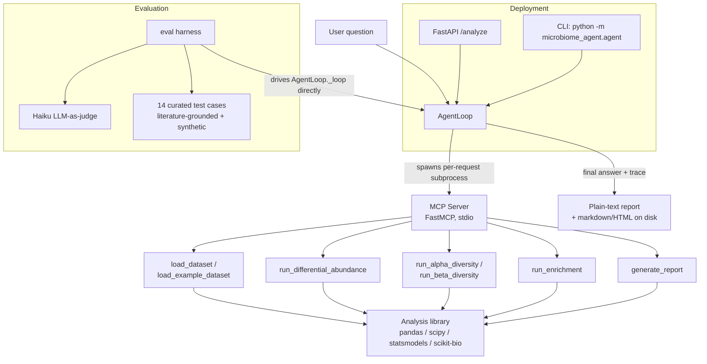

# microbiome-agent

[](https://github.com/YihuiSun/microbiome-agent/actions/workflows/ci.yml)

An autonomous microbiome differential-abundance and functional-enrichment
agent with built-in statistical validation and reproducible reporting — and,
just as importantly, an **automated evaluation harness** that measures
whether its scientific conclusions are actually correct.

> Status: **all five phases complete.** Analysis library → MCP server →
> agent loop → evaluation harness → containerized API with CI.

## Why this exists

Most "AI for bioinformatics" demos are thin wrappers around a single prompt.
This project is built the other way around: correct, defensible analysis
functions first; then an agent layer that orchestrates them over the Model
Context Protocol (MCP); then an eval harness that scores the agent, not just
the tools, on tool-selection accuracy and interpretation correctness. Every
tool follows the same shape — clear typed signature, loud failure on bad
input, one tidy return value — because that discipline is what makes a tool
safe for an LLM to call and easy to evaluate.

## Architecture



Design principle carried through every phase: **handles, not tables.** MCP
tools return a `dataset_id`/`analysis_id` and cache full results
server-side; the agent reasons over compact JSON findings, never raw
abundance matrices. State is session-scoped by construction — `AgentLoop`
spawns a fresh MCP server subprocess per run (see `agent/loop.py`), so the
FastAPI wrapper gets per-request isolation for free without any extra
session-management code (see `api/app.py` for the full explanation).

## Example run

```bash
python -m microbiome_agent.agent \
    "Analyse the example dataset. Run differential abundance, alpha and
     beta diversity, then generate a report."
```

```
======================================================================
The example dataset (24 samples, CRC vs. control) shows a clear
compositional shift:

- Differential abundance: Fusobacterium_nucleatum is significantly
  enriched in the CRC group (q=0.003, log2FC=+2.5), consistent with the
  Castellarin/Kostic literature signal this dataset is modeled on.
- Beta diversity: PERMANOVA confirms overall community composition
  differs significantly between groups (p=0.001).
- Alpha diversity: Shannon diversity is broadly similar between groups —
  no group-difference test was run (not part of this toolset); the
  reported means do not show a meaningful gap.
- Report written to reports/example_analysis/report.html

Caveats: q-values (BH-FDR, alpha=0.05) were used throughout, not raw
p-values. Sample size (n=24) is adequate for the beta-diversity PERMANOVA
result reported here.
======================================================================
model=claude-opus-4-5  turns=5  tool_calls=4  wall_time=18.3s
tokens: 3421 in / 612 out  ~$0.0324
Trace written to trace.json
```

(Illustrative — wording varies run to run; the eval harness below is what
actually checks whether the numbers and caveats are right.)

## Evaluation harness

```bash
python -m microbiome_agent.eval --dry-run    # free — no API key, no live model calls
python -m microbiome_agent.eval --n-runs 3   # live — calls the model, costs a few dollars
```

14 test cases (7 grounded in published case-control microbiome studies —
Castellarin/Kostic CRC, Scher RA, Qin T2D, Zeller CRC, Chang C. diff,
Turnbaugh obesity, Lloyd-Price IBD — plus 7 synthetic/behavioral cases:
null results, an FDR-vs-raw-p trap, small-n PERMANOVA, tool-selection
restraint, MCP error recovery, and two full chained pipelines), each scored
on deterministic tool-trace/statistics checks plus a Haiku LLM-as-judge pass
on the final answer's biological soundness and overstatement.

Latest live `--n-runs 3` scorecard:

```
Tool-selection accuracy: 100%
Incorrect-claim rate:    0%
Run-to-run consistency:  100%
```

See `phase4_eval_design.md` for the full case-by-case design rationale and
`src/microbiome_agent/eval/` for the implementation.

## Run it

### Locally (venv)

```bash
python3 -m venv .venv
source .venv/bin/activate          # Windows: .venv\Scripts\activate
python -m pip install --upgrade pip
pip install -r requirements.txt
pip install -e .                   # makes `microbiome_agent` importable

export ANTHROPIC_API_KEY="sk-ant-..."
python -m microbiome_agent.agent "Analyse the example dataset."
```

### As an API service

```bash
uvicorn microbiome_agent.api.app:app --reload
curl -X POST localhost:8000/analyze \
    -H 'Content-Type: application/json' \
    -d '{"question": "Analyse the example dataset and report what taxa differ between groups."}'
```

### In Docker

```bash
docker build -t microbiome-agent .
docker run --rm -p 8000:8000 -e ANTHROPIC_API_KEY=sk-ant-... microbiome-agent

# or the CLI:
docker run --rm -e ANTHROPIC_API_KEY=sk-ant-... microbiome-agent \
    python -m microbiome_agent.agent "Analyse the example dataset."

# or the free eval dry-run, to sanity-check the image with no API key:
docker run --rm microbiome-agent python -m microbiome_agent.eval --dry-run
```

## Tests

```bash
pytest -q                                  # 79 tests: analysis, MCP server, agent loop, API
python -m microbiome_agent.eval --dry-run  # 14 eval cases, no API key needed
```

Both run automatically on every push via GitHub Actions (`.github/workflows/ci.yml`).

## Project layout

```
microbiome-agent/
├── README.md
├── ROADMAP.md                  # phase-by-phase build log
├── phase4_eval_design.md       # eval case design/decision record
├── Dockerfile
├── requirements.txt / pyproject.toml
├── .github/workflows/ci.yml
├── src/microbiome_agent/
│   ├── analysis/                # Phase 1: differential_abundance, diversity, enrichment, report
│   ├── datasets/                # loaders + bundled synthetic example dataset
│   ├── mcp_server/              # Phase 2: FastMCP server, 8 tools, handle/summary I/O
│   ├── agent/                   # Phase 3: loop.py (agent loop), trace.py (Phase 5 tracing), __main__.py (CLI)
│   ├── eval/                    # Phase 4: 14 cases, checks, Haiku judge, fixtures, dry-run
│   └── api/                     # Phase 5: FastAPI wrapper
└── tests/
```

## Known limits (intentional)

- MCP dataset/analysis registries are in-memory and per-subprocess — the
  right lifetime for a single agent run or API request, not a shared,
  long-lived cache across requests.
- `run_enrichment` requires a prior `run_differential_abundance` call; there
  is no standalone enrichment path via MCP, and `feature_sets` must be
  supplied inline (no KEGG/MetaCyc catalogue loader yet).
- No prompt caching in the agent loop — cost scales with turn count since
  full history resends every turn (see `agent/trace.py` for per-run cost
  logging; a caching pass is a natural next optimization).
